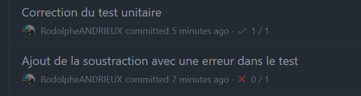
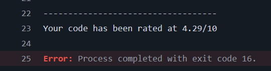
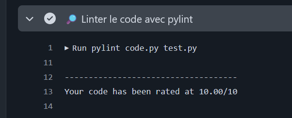
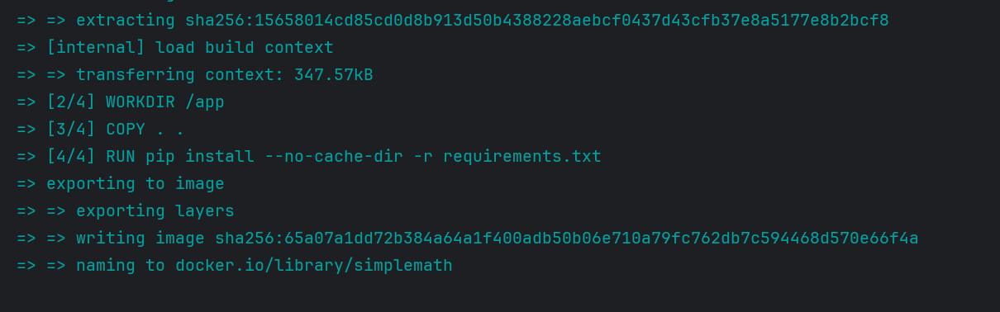
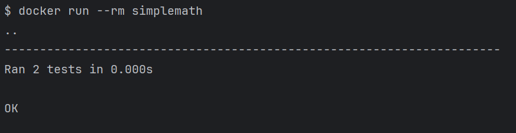
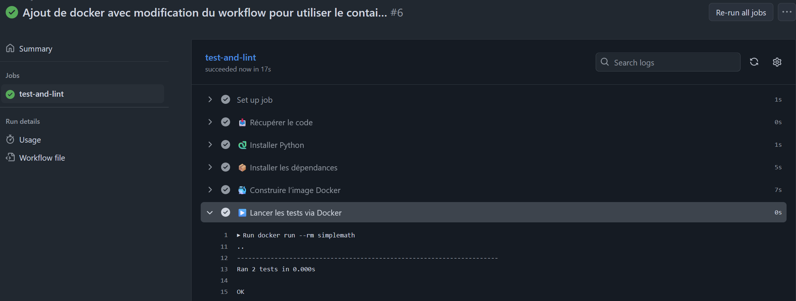

# TP CI/CD

# Creation du workflow avec test unitaire de l'addition

# Ajout de la soustraction avec un erreur pour tester le workflow

# Utilisation de pylint pour le linting

Le code ne semble pas respecter les conventions. (noté 4.29/10) "missing-docstring" les erreurs bloquantes.

Apres ajout de la doc, le test passe.

# Ajout de docker

test du dockerfile en local :

### Tout semble fonctioner 

